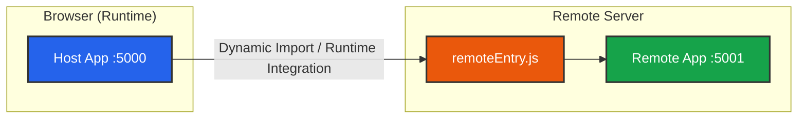

# Vite + pnpm Workspaces: Micro Frontends Sample

A modern, production-ready Micro Frontends sample application built with **Vite**, **pnpm Workspaces (Monorepo)**, and **React 19**, powered by the official `@module-federation/vite`.

---

## 🏗️ Architecture

This repository uses **Module Federation** to dynamically orchestrate multiple independent applications at runtime. The Host application (Port 5000) consumes the entire interface of the Remote application (Port 5001) seamlessly.



## 📁 Directory Structure

```plain
micro-frontends/
├── package.json
├── pnpm-workspace.yaml
└── packages/
    ├── host-app/          # Host (Parent) application - Port 5000
    └── remote-app/        # Remote (Child) application - Port 5001
```

## 🚀 Getting Started

```bash
# Install dependencies
pnpm install
# Start the Host and Remote applications concurrently
pnpm start
```
